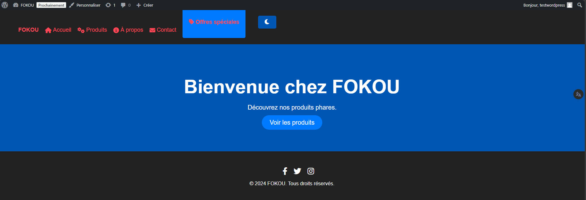
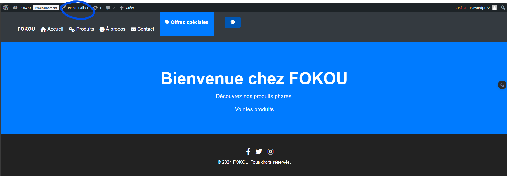
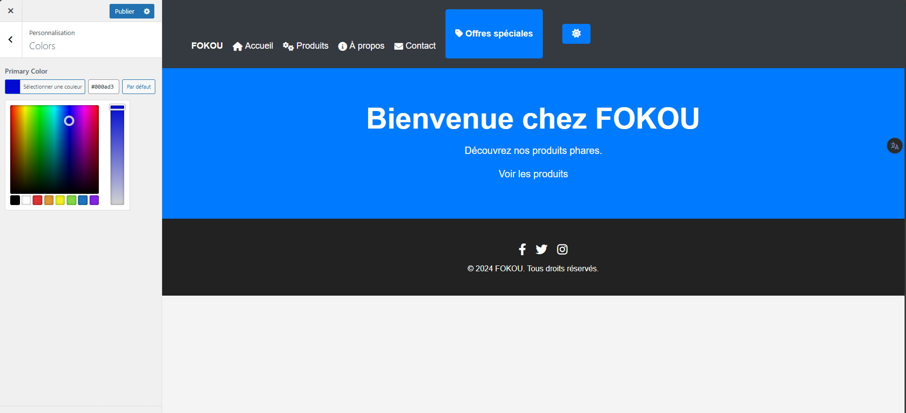

# Thème WordPress **Notre Thème Groupe1** - Groupe 1

## Introduction

Le thème **Notre Thème Groupe1** a été conçu spécialement pour répondre aux besoins des quincailleries, comme **FOKOU** et **QUIFEUROU**, offrant une interface élégante et moderne. Il est entièrement responsive, facile à personnaliser et optimisé pour améliorer l'expérience utilisateur, tout en mettant en avant des produits et services d'une quincaillerie. Ce thème est parfait pour toute entreprise souhaitant offrir une expérience web fluide, moderne et accessible sur tous les appareils.

### Fonctionnalités Principales

- **Mode Sombre** : Le thème intègre un mode sombre qui permet aux utilisateurs d'adapter l'apparence du site en fonction de la lumière ambiante, offrant ainsi un meilleur confort lors de la navigation dans des environnements peu éclairés. Pour activer ce mode, il vous suffit de cliquer sur l'icône de mode sombre dans la barre de navigation ou dans le menu.  
  *Note : Le mode sombre améliore l'accessibilité et réduit la fatigue visuelle lors des longues sessions de navigation.*
  

- **Personnalisation Facile** : **Notre Thème Groupe1** permet une personnalisation complète du site, du logo à l’arrière-plan, en passant par les couleurs du thème. Vous pouvez adapter chaque élément pour refléter l'identité de votre quincaillerie. Ajoutez votre propre logo, changez les couleurs pour correspondre à votre charte graphique, et personnalisez l'arrière-plan pour créer une ambiance unique qui met en avant vos produits.

- **Design Responsive** : Ce thème s'adapte parfaitement à tous les types d'appareils, que ce soit sur desktop, tablette ou mobile. L'utilisation de Flexbox et de CSS Grid assure une mise en page fluide qui s'ajuste en fonction de la taille de l'écran, garantissant une navigation agréable pour vos clients, peu importe l'appareil.

- **Menus Dynamiques** : Organisez facilement votre contenu avec les menus dynamiques. Créez des menus personnalisés pour afficher vos produits, services, catégories de produits ou toute autre section pertinente de votre site. Les menus sont gérés via l'interface WordPress, ce qui vous permet de mettre à jour votre navigation en quelques clics.

- **Widgets Utiles** : Le thème prend en charge les widgets natifs de WordPress, vous permettant d'ajouter des éléments tels que des promotions, des produits populaires, des témoignages clients, ou même une carte de localisation de votre magasin. Ces widgets sont faciles à ajouter dans la barre latérale ou le pied de page.

- **Images de Produits** : Chaque produit ou article peut être mis en avant avec des images attractives. Ajoutez une image mise en avant pour chaque article ou produit afin de le présenter de manière professionnelle. Pour cela, dans l'éditeur WordPress, vous avez un champ pour télécharger l'image de votre choix qui sera ensuite affichée sur la page produit.

### Comment Ajouter une Image de Produit
1. Dans le tableau de bord WordPress, allez dans **Articles** ou **Produits** (selon la configuration de votre site).
2. Sélectionnez l'article ou le produit auquel vous souhaitez ajouter une image.
3. Sur la droite de l'éditeur, trouvez la section **Image mise en avant**.
4. Cliquez sur **Définir l'image mise en avant**, puis téléchargez ou sélectionnez l'image que vous souhaitez utiliser depuis votre bibliothèque de médias.
5. Une fois l'image téléchargée, elle apparaîtra automatiquement sur la page de l'article ou du produit.

### Pourquoi Choisir le thème **Notre Thème Groupe1** ?

Le thème **Notre Thème Groupe1** est le choix idéal pour toute quincaillerie en ligne souhaitant proposer une expérience utilisateur moderne et fluide, tout en mettant en valeur ses produits. Sa facilité de personnalisation et ses nombreuses fonctionnalités permettent aux propriétaires de quincailleries de gérer leur site Web de manière autonome tout en offrant une interface professionnelle et agréable.

Ce thème a été spécialement conçu pour s'adapter à l’univers des quincailleries, en mettant l'accent sur la clarté, la simplicité et l'efficacité dans la présentation des produits.

## Installation

1. **Télécharger le fichier ZIP** du thème depuis le dépôt ou le site web.
2. **Installer le thème** via l'interface d'administration WordPress : 
   - Allez dans **Apparence > Thèmes** puis cliquez sur **Ajouter**.
   - Téléchargez et activez le thème.
3. **Personnaliser le thème** : 
   - Une fois installé, accédez à **Apparence > Personnaliser** pour configurer les éléments du thème selon vos préférences.

### Configuration des Couleurs et du Logo

- **Couleurs** : Vous pouvez changer les couleurs de fond, de texte, des liens, etc., via le menu **Apparence > Personnaliser > Couleurs**.
- **Logo et En-tête** : Ajoutez votre logo et personnalisez l'en-tête du site via **Apparence > Personnaliser > En-tête**.

## Conclusion

Avec le thème **Notre Thème Groupe1**, créez un site WordPress moderne, adapté aux quincailleries et offrant une expérience utilisateur optimale. Que vous gériez une boutique en ligne ou un site vitrine pour votre quincaillerie, **Notre Thème Groupe1** vous fournit tous les outils nécessaires pour réussir sur le web.
